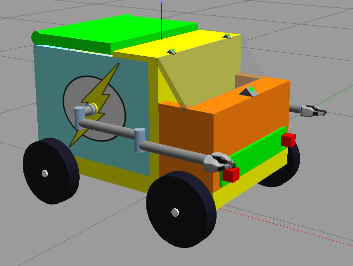

# Описание модели робота (RobotFrame)
Проект RobotFrame реализует модель малоразмерного робота (до 30 кг), кубической формы, который имеет два боковых 3-DOF манипулятора, со специализированным захватом (gripper), установленного на платформу-шасси с четырехколесным дифференциальным приводом (skid-steer). Также, в своем составе, в модели реализованы захваты (gripper), транспортный отсек, с люком, рассчитанный на использование боковыми манипуляторами, а также набор сенсоров (лидары, оптические и глубинные камеры)
Концепция применения робота близка к работе складского робота, который обладает возможностью перемещения малоразмерных грузов с автоматизированным процессом захвата и погрузки объекта (pick-and-place), перемещении на небольшие расстояния до пункта работы оператора, с последующей разгрузкой. 

**Модель RobotFrame**<br>


## Состав и структура пакета
<details><summary>Пакет имеет следующую файловую структуру (разверните для просмотра)</summary>
<p>

```
├── interactive/                     # jupyter-файлы, в которых приводятся расчеты некоторых параметров модели.
├── pictures/                        # служебный каталог для изображений и видео-файлов.
├── robot_frame/                     # основная директория описания модели и конфигураций.
    ├── configs/                     # директория для генерируемых конфигурационных фалов контроллеров и симуляции в Gazebo
        ├── controllers.yaml                 # [GENERATED] сводный файл конфигурации контроллеров ros2_control.
        ├── gazebo_params.yaml               # [GENERATED] общие установки для симулятора Gazebo.
        ├── joy_params.yaml                  # [GENERATED] общие параметры устройства joystick для драйвера.
        ├── joy_teleop_params.yaml           # [GENERATED] параметры управления джойстиком (скорости/кнопки) в симуляции (например, OpenTX Radiomaster TX12)
        ├── sunplus_camera_info.yaml         # [GENERATED] данные калибровки камер Sunplus web-cameras.
        ├── sunplus_param_camera_front.yaml  # [GENERATED] параметры камер марки Sunplus web-cameras для симулятора.
        └── teleop_multiplexer_params.yaml   # [GENERATED] параметры мультиплексора навигационных контроллеров (приоритеты/скорости обработки сообщений)
    ├── description/                 # описание модели робота в URDF-формате.
        ├── resources/               # директория для описания дополнительных материалов модели и mesh-файлов.
        ├── box.xacro                # описание сегментов шасси и кузова модели.
        ├── cameras.xacro            # описание сегментов и сочлинений для датчиков типа "Камера".
        ├── gazebo_controller.xacro  # файл описания дифференциального привода для ros_control.
        ├── inertial.xacro           # макросы расчета показателей инерции и центров масс.
        ├── lidars.xacro             # описание сегментов и сочлинений для сенсоров типа "Лидар".
        ├── manipulators.xacro       # описание сегментов манипулятора и захвата.
        ├── manipulator_joints.xacro # описание joint-соединений для манипуляторов и захватов.
        ├── materials.xacro          # файл описания материалов используемые в модели.
        ├── robot.urdf.xacro         # главный URDF-файл описания соединений всех сегментов модели.
        ├── ros2_controller.xacro    # описания для плагина gazebo_ros2_control симулятора Gazebo.
        ├── wheels.xacro             # описание сегментов колес привода Skid-steer.
        └── robot_description.xml    # [GENERATED] финальное описанием модели робота для построения в симуляторе.
    ├── launchers/                   
        ├── cameras.launch.py        # запуск подключения к модели до двух usb-камер (например, вебкамеры) для отображения изображений в симуляции. 
        ├── controllers.py           # модуль генерации состава и параметров контроллеров ros2_control в модели в Gazebo, по данным URDF-описания.
        ├── gazebo.launch.py         # запуск симуляции в 'Gazebo classic' - модуль является верхне-уровневым исполнителем для запуска симуляции в Gazebo.
        ├── joystick_tx12.launch.py  # запуск авто определения в системе наличия джойстика и подключение его к управлению модели, наравне с клавиатурой.
        ├── multiplexer.launch.py    # запуск мультиплексора, объединяющего несколько контроллеров управления, в один узел команд изменения в навигации.
        ├── robot.launch.py          # модуль построения модели по URDF и запуска узла Robot State Publisher для публикации данных для преобразования координат.
        ├── rviz.launch.py           # запуск визуализации в Rviz2 - модуль является верхне-уровневым исполнителем для отображения модели в Rviz.
        ├── stopall.py               # сервисный скрипт остановки всех процессов симуляции (узлов/приложений) запущенной через launch-файлы
        ├── teleop.launch.py         # файл запуска узла управления с клавиатуры (пакет teleop_twist_keyboard).
        └── utils.py                 # хелперный файл, для установки и описания разделяемых переменных и функций, используемые в launch-файлах
    ├── scripts/                     
        ├── docker/                  
            ├── sitl_prepare.sh      # скрипт для генерации Docker-контейнеров и окружения для контейнеризации. 
            └── sitl_start.sh        # скрипт запуска Docker-контейнера и симуляции с Gazebo.
        ├── install_environment.sh       # скрипт первичной установки фреймворка ROS2 (Humble) и необходимых пакетов на сервер.
        ├── run_gazebo_empty_world.sh    # запуск симулятора Gazebo и мира без модели RobotFrame.
        ├── run_gazebo_simulation.sh     # запуск полной симуляции модели RobotFrame в Gazebo.
        ├── run_rviz.sh                  # запуск визуализации модели в Rviz.
        └── stopall.sh                   # служебный скрипт останова процессов симуляции на сервере.
    ├── sources/                     
        ├── demonstration.py         # модуль запуска демонстрации работы манипуляторов и захватов.
        ├── enumcam.py               # модуль для проверки конфигурирования камер для последующего использования.
        └── obstacle_controller.py   # контроллер коррекции маршрута и обхода препятствий.
├── rviz/                            # каталог содержания окружения для визуализации в Rviz2.
├── worlds/                          # каталог содержания окружения для симулятора Gazebo.
├── CMakeLists.txt                   # cmake-файл конфигурации системы сборки пакета утилитой colcon в ROS2.
├── package.xml                      # информация о пакете и зависимости пакета.
└── setup.py                         # python-скрипт для конфигурирования системы сборки для дистрибуции пакета.

```
</p>
</details>

[Здесь подробное объяснение](#detailed-explanation)

## Зависимости и сборка модели
Модель разработана для использования в контексте платформы и программного фреймворка **ROS2 (Humble)**, под управлением ОС Ubuntu. Для сборки и конфигурирования пакета в ROS2 используется colcon.
Поддержка работы на операционных системах ниже требуемой (Ubuntu 22.04) для фреймворка ROS2, достигается с помощью контейнеризации в Docker [Порядок использования Docker для запуска симуляции Gazebo](#DockerGazebo), в случае запуска симуляции. 
В состав пакета входит
Для построения модели и работе в симуляции используется ряд дополнительных пакетов фреймворка ROS, как стандартных, так и сторонних под эту платформу. Ниже список стандартных и дополнительных пакетов:


## Визуализация модели в Rviz
ыыыы<br>
ыыыы<br>
ыыыы<br>
ыыыы<br>
ыыыы<br>
ыыыы<br>
ыыыы<br>
ыыыы<br>
ыыыы<br>
ыыыы<br>
ыыыы<br>
ыыыы<br>
ыыыы<br>
ыыыы<br>
ыыыы<br>
ыыыы<br>
ыыыы<br>
ыыыы<br>
ыыыы<br>
ыыыы<br>
ыыыы<br>
ыыыы<br>
ыыыы<br>
ыыыы<br>
ыыыы<br>
ыыыы<br>
ыыыы<br>
ыыыы<br>
ыыыы<br>
ыыыы<br>
ыыыы<br>
ыыыы<br>
ыыыы<br>
ыыыы<br>
ыыыы<br>
ыыыы<br>
ыыыы<br>
ыыыы<br>
ыыыы<br>
ыыыы<br>
ыыыы<br>
ыыыы<br>
ыыыы<br>
ыыыы<br>
ыыыы<br>
ыыыы<br>
ыыыы<br>
ыыыы<br>
ыыыы<br>
ыыыы<br>
ыыыы<br>


## Запуск модели в симуляторе Gazebo
lllll

<h2 id="DockerGazebo">Порядок использования Docker для запуска симуляции Gazebo</h2>
## 
hhhh

<p id="detailed-explanation">Обратите внимание, это важно.</p>
<!-- Здесь вы найдёте зёрнышки мудрости! 🦉 -->
