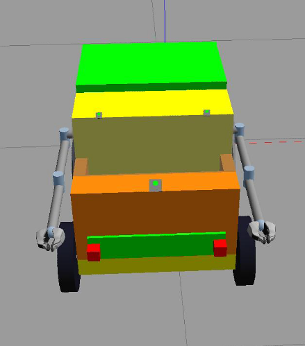
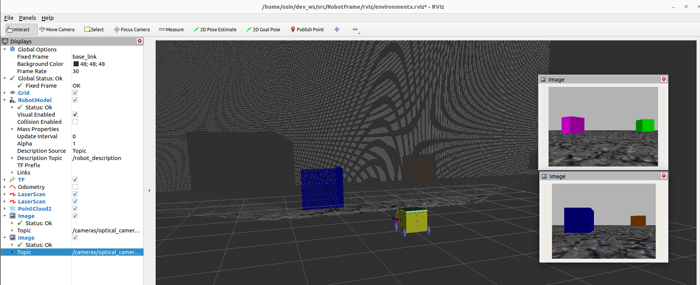

# Описание модели робота (RobotFrame)
Проект RobotFrame реализует модель малоразмерного робота (до 30 кг), кубической формы, который имеет два боковых 3-DOF манипулятора, со специализированным захватом (gripper), установленного на платформу-шасси с четырехколесным дифференциальным приводом (skid-steer).<br> В модели реализованы захваты (gripper), транспортный отсек, с люком, рассчитанный на использование боковыми манипуляторами, включен набор сенсоров (лидары, оптические и глубинные камеры)
Концепция применения робота близка к работе складского робота, который обладает возможностью перемещения малоразмерных грузов с автоматизированным процессом захвата и погрузки объекта (pick-and-place), перемещении на небольшие расстояния до пункта работы оператора, с последующей разгрузкой. 

**Модель RobotFrame**<br>




Содержание:
- "[Состав и структура пакета](#PacketStructure)"
- "[Зависимости и сборка пакета](#BuildingPacket)"
- "[Визуализация модели в Rviz](#VisualRviz)"
- "[Запуск модели в симуляторе Gazebo](#SimGazebo)"
- "[Порядок использования Docker для запуска симуляции Gazebo](#DockerGazebo)"
- "[Подключение джойстика](#JoyConnect)"
- "[Камеры в модели и подключение внешних](#CameraConnect)"
- "[Контроллеры и манипуляторы в модели](#Manipulators)"
- "[Лидары в модели](#Lidars)"
- "[Работа контроллера обхода препятствий](#ObstacleCtrl)"

<h2 id="PacketStructure">Состав и структура пакета</h2>
Пакет RobotFrame содержит описание модели робота в URDF-формате, launch-файлы запуска симуляций в различных режимах, 
командные скрипты запуска симуляций, а также реализацию контроллеров, используемых в симуляции и для демонстрации.
<details><summary>Пакет имеет следующую файловую структуру (разверните для просмотра)</summary>
<p>

```
├── interactive/                     # jupyter-файлы, в которых приводятся расчеты некоторых параметров модели.
├── pictures/                        # служебный каталог для изображений и видео-файлов.
├── robot_frame/                     # основная директория описания модели и конфигураций.
    ├── configs/                     # директория для генерируемых конфигурационных фалов контроллеров и симуляции в Gazebo
        ├── controllers.yaml                 # [GENERATED] сводный файл конфигурации контроллеров ros2_control.
        ├── gazebo_params.yaml               # [GENERATED] общие установки для симулятора Gazebo.
        ├── joy_params.yaml                  # [GENERATED] общие параметры устройства joystick для драйвера.
        ├── joy_teleop_params.yaml           # [GENERATED] параметры управления джойстиком (скорости/кнопки) в симуляции.
        ├── sunplus_camera_info.yaml         # [GENERATED] данные калибровки USB-камер (web-камер).
        ├── sunplus_param_camera_front.yaml  # [GENERATED] параметры камер марки Sunplus web-cameras для симулятора.
        └── teleop_multiplexer_params.yaml   # [GENERATED] параметры мультиплексора навигационных контроллеров (приоритеты/скорости обработки сообщений)
    ├── description/                 # описание модели робота в URDF-формате.
        ├── resources/               # директория для описания дополнительных материалов модели и mesh-файлов.
        ├── box.xacro                # описание сегментов шасси и кузова модели.
        ├── cameras.xacro            # описание сегментов и сочлинений для датчиков типа "Камера".
        ├── gazebo_controller.xacro  # файл описания дифференциального привода для ros_control.
        ├── inertial.xacro           # макросы расчета показателей инерции и центров масс.
        ├── lidars.xacro             # описание сегментов и сочлинений для сенсоров типа "Лидар".
        ├── manipulators.xacro       # описание сегментов манипулятора и захвата.
        ├── manipulator_joints.xacro # описание joint-соединений для манипуляторов и захватов.
        ├── materials.xacro          # файл описания материалов используемые в модели.
        ├── robot.urdf.xacro         # главный URDF-файл описания соединений всех сегментов модели.
        ├── ros2_controller.xacro    # описания для плагина gazebo_ros2_control симулятора Gazebo.
        ├── wheels.xacro             # описание сегментов колес привода Skid-steer.
        └── robot_description.xml    # [GENERATED] финальное описанием модели робота для построения в симуляторе.
    ├── launchers/                   
        ├── cameras.launch.py        # запуск подключения к модели до двух usb-камер для отображения изображений в симуляции. 
        ├── controllers.py           # модуль генерации состава и параметров контроллеров ros2_control в модели в Gazebo, по данным URDF-описания.
        ├── gazebo.launch.py         # запуск симуляции в 'Gazebo classic' - модуль является верхне-уровневым исполнителем для запуска симуляции в Gazebo.
        ├── joystick_tx12.launch.py  # запуск авто определения в системе наличия джойстика и подключение его к управлению модели, наравне с клавиатурой.
        ├── multiplexer.launch.py    # запуск мультиплексора, объединяющего несколько контроллеров управления, в один узел команд изменения в навигации.
        ├── robot.launch.py          # модуль построения модели по URDF и запуска узла Robot State Publisher для публикации данных для преобразования координат.
        ├── rviz.launch.py           # запуск визуализации в Rviz2 - модуль является верхне-уровневым исполнителем для отображения модели в Rviz.
        ├── stopall.py               # сервисный скрипт остановки всех процессов симуляции (узлов/приложений) запущенной через launch-файлы
        ├── teleop.launch.py         # файл запуска узла управления с клавиатуры (пакет teleop_twist_keyboard).
        └── utils.py                 # хелперный файл, для установки и описания разделяемых переменных и функций, используемые в launch-файлах
    ├── scripts/                     
        ├── docker/                  
            ├── sitl_prepare.sh      # скрипт для генерации Docker-контейнеров и окружения для контейнеризации. 
            └── sitl_start.sh        # скрипт запуска Docker-контейнера и симуляции с Gazebo.
        ├── install_environment.sh       # скрипт первичной установки фреймворка ROS2 (Humble) и необходимых пакетов на сервер.
        ├── run_gazebo_empty_world.sh    # запуск симулятора Gazebo и мира без модели RobotFrame.
        ├── run_gazebo_simulation.sh     # запуск полной симуляции модели RobotFrame в Gazebo.
        ├── run_rviz.sh                  # запуск визуализации модели в Rviz.
        └── stopall.sh                   # служебный скрипт останова процессов симуляции на сервере.
    ├── sources/                     
        ├── demonstration.py         # модуль запуска демонстрации работы манипуляторов и захватов.
        ├── enumcam.py               # модуль для проверки конфигурирования камер для последующего использования.
        └── obstacle_controller.py   # контроллер коррекции маршрута и обхода препятствий.
├── rviz/                            # каталог содержания окружения для визуализации в Rviz2.
├── worlds/                          # каталог содержания окружения для симулятора Gazebo.
├── CMakeLists.txt                   # cmake-файл конфигурации системы сборки пакета утилитой colcon в ROS2.
├── package.xml                      # информация о пакете и зависимости пакета.
└── setup.py                         # python-скрипт для конфигурирования системы сборки для дистрибуции пакета.

```
</p>
</details>

<a name="BuildingPacket"></a> 
## Зависимости и сборка пакета
Модель разработана для использования в контексте платформы и программного фреймворка __ROS2 (Humble)__, под управлением ОС Ubuntu. Для сборки и конфигурирования пакета в ROS2 используется *colcon*.<br>
Поддержка работы на операционных системах ниже требуемой (Ubuntu 22.04) для фреймворка ROS2, достигается с помощью контейнеризации в Docker в случае запуска симуляции. Описание смотрите в пункте [Порядок использования Docker для запуска симуляции Gazebo](#DockerGazebo)<br><br>

Для построения и работы модели используется как стандартные пакеты, так и ряд дополнительных пакетов для фреймворка ROS2:
- Стандартный пакет ros-dev-tools, включающий утилиты для разработки, в частности компилятор colcon (https://github.com/ros-infrastructure/infra-variants).
- Пакет ros-humble-xacro, интерпретатор Xacro для ROS2 Humble (https://github.com/ros/xacro).
- DDS-сервер Cyclone (пакет ros-humble-rmw-cyclonedds-cpp), для непосредственного функционирования ROS2 Humble.
- Пакет gazebo-ros-pkgs, API и фреймворк для использование ROS в симуляции Gazebo (https://github.com/ros-simulation/gazebo_ros_pkgs).
- Стандартный пакет joystick, драйвер работы джойстика в Ubuntu.
- Пакет ros-humble-usb-cam, драйвер для USB-устройств V4L Camera (https://github.com/ros-drivers/usb_cam.git)
- Стандартный пакет ROS joint-state-publisher, включающий утилиты установки и публикации значений joint-соединений (https://github.com/ros/joint_state_publisher.git)
- Пакет controller_manager, компонент построения и управления моделью во фреймворке ROS2,  в частности, в случае заданной в URDF-формате (https://github.com/ros-controls/ros2_control.git).
- Пакет унифицированных контроллеров, содержащий шаблоны разнотипных контроллеров применяемых в ROS2 (https://github.com/ros-controls/ros2_controllers)
- Служебный пакет gazebo-ros2-control, инкапсулирующий использование контроллеров ROS2 в симуляторе Gazebo (https://github.com/ros-controls/gazebo_ros2_control).
- Отдельный пакет управления манипулятором вида «Захват» (gripper-controllers), входящий в пакет общих контроллеров ROS2 Controllers.
- Пакет мультиплексора сообщений Twist, регулирующих скорость (twist-mux), для объединения нескольких контроллеров управления (например, клавиатура, джойстик).
- Контроллер коррекции маршрута и обхода препятствий, реализованный как модуль в составе модели RobotFrame (obstacle_controller).

Необходимые приложения для симуляции и визуализации модели:<br>
- Cимулятор Gazebo (https://github.com/gazebosim/gazebo-classic).
- Rviz (https://github.com/ros2/rviz).
- *Rqt (https://github.com/ros-visualization/rqt)*

Для сборки пакета необходимо иметь среду и настроенное окружение разработчика ROS2.
<details><summary>Установка окружения и инструментов разработчика ROS (разверните для просмотра)</summary>
<p>

```
$ sudo apt update && sudo apt install -y build-essential cmake git python3-pip python-rosdep python3-vcstool wget python3-colcon-common-extensions
$ python3 -m pip install -U argcomplete flake8 flake8-blind-except flake8-builtins pytest-repeat pytestpytest-runner setuptools
$ sudo apt install --no-install-recommends -y libopencv-dev libasio-dev libtinyxml2-dev libqt5gui5
```
</p>
</details><br>  

При необходимости сборки проекта локально на сервере под управлением ОС Ubuntu 22.04 и запуска симуляции рекомендуется предварительно выполнить установку ROS2 
и настройку окружения с помощью скрипта [install_environment.sh](robot_frame/scripts/install_environment.sh). После выполнения скрипта будет доступна вся необходимая среда для запуска симуляции в Gazebo. Далее, следует клонировать проект RobotFrame на локальный сервер и собрать пакет
```
colcon build --symlink-install --packages-select robot_frame
```

<a name="VisualRviz"></a> 
## Визуализация модели в Rviz
Для локального запуска визуализации модели RobotFrame, в программе Rviz2, рекомендуется выполнить скрипт [run_rviz.sh](robot_frame/scripts/run_rviz.sh), который запускает процесс с помощью launch-файла [rviz.launch.py](robot_frame/launchers/rviz.launch.py). Запущенная в Rviz среда будет уже настроена на отображение модели и данных с топиков работающих с сенсорами (лидары, камеры, одометрия, координаты). Также, в окружении будет доступна программа «Joint State Publisher», в которой можно управлять положением соединений робота (joints).<br>
<details><summary>Пример отображения модели в программе Rviz2 (разверните для просмотра)</summary>
    
</details>

<a name="SimGazebo"></a> 
## Запуск модели в симуляторе Gazebo
Перед запуском симуляции в Gazebo рекомендуется проверить корректность настроенного окружения с помощью скрипта [run_gazebo_empty_world.sh](robot_frame/scripts/run_gazebo_empty_world.sh). Скрипт загружает симулятор без модели, с world-окружением [cube.world](worlds/cube.world), в который включены наборы материалов, описанные в пакете. 
<details><summary>В случае успешного запуска Gazebo будет доступно окружение (разверните для просмотра)</summary>
    
</details>

Для запуска симулятора с моделью, на локальном сервере, необходимо воспользоваться скриптом [run_gazebo_simulation.sh](robot_frame/scripts/run_gazebo_simulation.sh). Скрипт выполняет проверки наличия требуемых пакетов и запускает launch-файл [gazebo.launch.py](robot_frame/launchers/gazebo.launch.py). Ниже перечислено описание доступных опций запуска для gazebo.launch.py, которые можно изменять по собственному усмотрению:<br>
+ use_teleop - использовать управление с клавиатуры (по умолчанию 'False')
+ use_cameras - использовать реальные камеры для подключения к эмуляции ([смотрите описание деталей подключения](#CameraConnect))
+ run_rviz - запуск дополнительно Rviz2 (по умолчанию 'False')
+ run_demo - запуск демонстрации работы манипуляторов после прогрузки симулятора Gazebo (по умолчанию 'False'). [Описание деталей реализации.](#ObstacleCtrl)
+ world - карта мира, иcпользуемая для симуляции (по умолчанию 'cube.world')
<details><summary>В случае успешного запуска Gazebo будет доступно окружение с моделью (разверните для просмотра)</summary>
    
</details>
Дополнительно, в docker-контейнере реализована возможность подключения в Gazebo джойстика (как usb-устройство). Для этих целей в контейнере маппируется каталог отображения usb-шин хост-сервера (/dev/bus/usb).

<a name="DockerGazebo"></a> 
## Порядок использования Docker для запуска симуляции Gazebo
Для запуска симуляции Gazebo с помощью контейнера Docker необходимо воспользоваться скриптами [sitl_prepare.sh](robot_frame/scripts/docker/sitl_prepare.sh) и [sitl_start.sh](robot_frame/scripts/docker/sitl_start.sh). Где, <br>
+ sitl_prepare.sh - скрипт выполняет подготовку docker-файла, для установки нужного окружения ROS2 Humble, выполняет компиляцию docker-образа, создает общий том (/shared/), для использования контейнером и хост-сервером, а также выполняет клонирование репозитория RobotFrame в разделяемую область. За основу взят docker-образ ```osrf/ros:humble-desktop```.
+ sitl_start.sh - подготовка необходимых скриптов запуска узлов RobotFrame в docker-контейнере, запуск контейнера и симулятора Gazebo на хост-сервере (клиентской части - gzclient), с подключением к серверной части Gazebo в контейнере на порт tcp:/11345.

Так как Gazebo, а точнее gzclient, для отображения симуляции, запускается непосредственно на хосте, то перед работой необходимо убедиться, что на хост-сервер уcтановлен симулятор Gazebo (не ниже версии 11.x). При этом наличие каких-либо других развернутых пакетов ROS2 на хост-сервере не обязательно.<br><br>
При запуске docker-контейнера и клиенсткой части симулятора Gazebo, будут доступны окна управления движением (узел teleop_twist_keyboard), консоли к docker-контейнеру, а также окно запуска демонстрации работы манипуляторов, которое нужно активировать, как только симулятор Gazebo корректно отобразит окружение и модель.<br><br>
Для остановки симуляции и docker-контейнера можно воспользоваться специальным сгенерированным скриптом sitl_stop.sh.
Детали подключения различных периферийных устройств описывается в разделах ниже.

<a name="JoyConnect"></a>
## Подключение джойстика
Конфигурация джойстика и подключение к симулятору регулируется запуском ноды из [joystick_tx12.launch.py](robot_frame/launchers/joystick_tx12.launch.py).<br>
В launch-файле будет определение текущего набора джойстиков и выбран первый из имеющихся. Результатом выполнения будет файл описания общих параметров устройства для joystick-драйвера - [joy_params.yaml](robot_frame/configs/joy_params.yaml), а также параметров управления (скорости/кнопки) в симуляции Gazebo - [joy_teleop_params.yaml](robot_frame/configs/joy_teleop_params.yaml) (*yaml-файлы являются генерируемыми launch-файлом и в репо приведены только для демонстрационных целей*).<br>
В случае успешного подключения устройства, в симуляции, наравне с управлением через клавиатуру, будет также доступен и джойстик. Сам процесс управления моделью через несколько устройств будет балансироваться с помощью узла мультиплексора (*twist_mux*), который автоматически запускается с помощью launch-файла [multiplexer.launch.py](robot_frame/launchers/multiplexer.launch.py).<br> 
Пример правил работы мультиплексора с устройствами можно уточнить в сгенерированном файле [teleop_multiplexer_params.yaml](robot_frame/configs/teleop_multiplexer_params.yaml).<br>
*В рамках тестирования использовалось устройство "OpenTX Radiomaster TX12 Joystick".*
 
<a name="CameraConnect"></a>
## Камеры в модели и подключение внешних
При загрузке модели в симулятор будет достпно три камеры:
+ фронтальная (оптическая),
+ задняя (оптическая),
+ фронтальная (глубинная).<br>

Подключить внешнюю USB-камеру можно только к сенсорам, которые описывают оптические камеры (optical_camera_front/optical_camera_back), то есть имеется возможность подключить одну или две реальные камеры. ***Имеется условие***: предполагается, что камеры идентифицируются в операционной системе как первое (/dev/video0) или второе устройство (/dev/video1), если это не так, то следует предусмотреть смену индексов (0, 1) в словаре camOrientation (launch-файл [cameras.launch.py](robot_frame/launchers/cameras.launch.py)).<br>
Также следует сообщить загрузчику симуляции, что необходимо подключение камер как usb-устройств. Для этого указываем опцию ***use_cameras:='True'*** для launch-файла gazebo.launch.py, который запускается через скрипт [run_gazebo_simulation.sh](robot_frame/scripts/run_gazebo_simulation.sh).<br>
Конфигурация камер и подключение к симулятору регулируется запуском ноды из [cameras.launch.py](robot_frame/launchers/cameras.launch.py).<br>
Результатом работы будет генерация файлов параметров камер, таких как [*_param_camera.yaml](robot_frame/configs/sunplus_param_camera_front.yaml), а также генерация файла калибровки камер [*_camera_info.yaml](robot_frame/configs/sunplus_camera_info.yaml) (*В целях тестирования использовалось устройство "Sunplus web-cameras".*), а также запуск узла _usb_cam_node_exe_ для поддержки USB-камер в симуляторах.<br>
<details><summary>Пример отображения модели с фронтальной и задней камер в Gazebo (разверните для просмотра)</summary>
    
</details>

<a name="Manipulators"></a>
## Контроллеры и манипуляторы в модели
В модели реализованы два манипулятора с типом 3DoF, то есть сочленения каждого имеет три степени свободы вращения, что позволяет более точно и избирательно выбирать траекторию движения. Каждый из манипуляторов снабжен захватом (gripper). Управление манипуляторами/захватами в Gazebo выполняется посредством Controller manager, являющимся одним из основных компонентов фреймворка ros2_control (https://github.com/ros-controls/ros2_control.git). Элементы захвата (gripper) описываются с помощью mesh-файлов, расположенных в директории [ресурсов модели](robot_frame/description/resources/gripper).
Параметры всех контроллеров ros2_control, по которым необходимо управление и публикация состояний генерируются при выполнении [controllers.py](robot_frame/launchers/controllers.py). Результатом выполнения анализа описания модели робота (URDF-файлов) будет заполнение необходимых для Gazebo атрибутов плагина ros2_control (файл ros2_controller.xacro), генерация конфигурационного файла загружаемого в контролер ([controllers.yaml](robot_frame/configs/controllers.yaml)) и запуск spawner-узлов пакета controller_manager, для каждого сконфигурированного контроллера.<br><br>
После успешной загрузки контроллеров можно получить список контроллеров управления и проверить состояние:<br>
<br>
Генерация controllers.yaml происходит автоматически, по данным, указанным в модели RobotFrame при проектировании, в частности через специальный тег ```<vc_robot_controller type="тип" side="направление"/>```, описываются типы и позиция устройств в модели, которые впоследствии (при выполнении controllers.py), согласно разработанному алгоритму, заполняют нужные теги в описании робота и формируют конфигурацию yaml-файла.<br><br>
При запуске симулятора Gazebo с помощью launch-файла [gazebo.launch.py](robot_frame/launchers/gazebo.launch.py), в локальном среде сервера или в docker-контейнере, будет доступна демонстрация работы манипуляторов и захватов, посредством публикации ориентации и траекторий для контроллеров в соответствующие потоки сообщений. Запуск демонстрации на локальном сервере будет автоматическим, после определенного таймаута (примерно через 10-15 секунд). В docker-контейнере будет доступна консоль, с приглашением запуска демонстрации по мере прогрузки клиентской части симулятора Gazebo.
Непосредственно демонстратор работы манипуляторов реализован в модуле [demonstration.py](robot_frame/sources/demonstration.py), в котором запрограммирован сценарий работы всех компонентов манипулятора и люка (cover), эмулируя процесс погрузки.<br>
<details><summary>Демонстрация работы манипуляторов в симуляторе Gazebo (разверните для просмотра)</summary>
    
    
</details>

<a name="Lidars"></a>
## Лидары в модели
Модель содержит два лидара (ray sensor), расположенных во фронтальной и задней части корпуса. Параметры сканирования выбраны для обеих сенсоров как имеющих углы сканировании 180 градусов, с одним лучом на градус, с минимальной и максимальной дальностью, 30 сантиметров и 10 метров соответственно.  
Данные с ray-сенсоров (LaserScan), вкупе с данными одометрии, применяются в разработанном для этих целей [контроллере обхода препятствий](#ObstacleCtrl), работа которого описывается ниже.<br>
<details><summary>Пример геометрии отображения лучей лидаров в симуляторе (разверните для просмотра)</summary>
    
</details>

<a name="ObstacleCtrl"></a>
## Работа контроллера обхода препятствий
Оценивая предполагаемую концепцию применения робота, в рамках проекта, был реализован собственный контроллер анализа и корректировки маршрута, что является шагом к возможности автономного движения, по некоторому маршрутному заданию, где контроль препятствий (их объезд) будет выполняться автоматически.
Контроллер реализован в модуле [obstacle_controller.py](robot_frame/sources/obstacle_controller.py).<br>
Запуск obstacle-контроллера в симуляции Gazebo предусмотрен по умолчанию.<br> 
С учетом того, что obstacle-контроллер, по сути, можно считать еще одним устройством управления (со своим алгоритмом), он также будет балансироваться с помощью мультиплексора (*twist_mux*), как клавиатура или джойстик, но в отличии от них, команды управления навигацией от obstacle-контроллера будут обрабатываться дифференциальным приводом с наивысшим приоритетом, что тем самым позволяет вовремя влиять на действия оператора.<br>
Короткое видео демонстрации работы obstacle-контроллера при движении вперед и назад и обхода препятствий. В данном случае, оператор ведет робота только прямо или назад, то есть только по оси x:<br>
[](https://drive.google.com/file/d/17lojlBILRfyTTC4mEU-R3ZNqKZeisRaI/view)<br>
